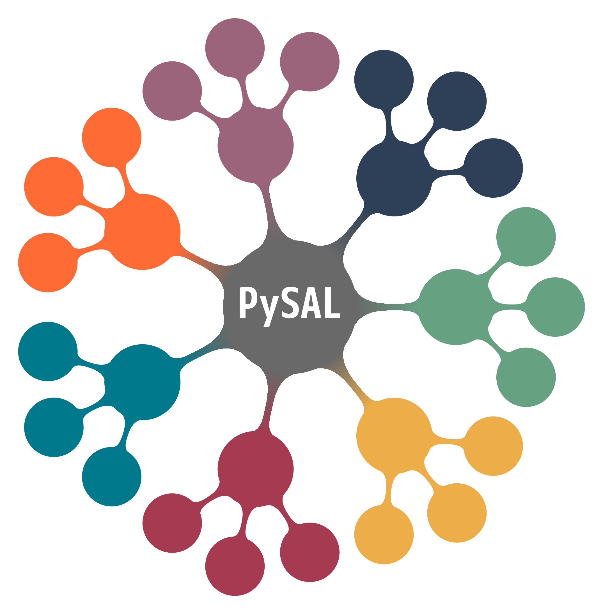

# workshop-pysal-sew24

[](https://codespaces.new/sjsrey/pysal-sew24)

[](https://mybinder.org/v2/gh/sjsrey/pysal-sew24/main?urlpath=lab)

Spatial Analysis and Econometrics with PySAL

<p align="center">

</p>

### Instructor

* Serge Rey - San Diego State University

---

## Schedule

### Part 1 Spatial Data Analysis
* geoprocessing & visualization
* spatial weights
* spatial autocorrelation


### Break

### Part 2  Spatial Econometrics

* cross sectional models
* spatial regime models
* spatial SUR models

## Getting Started

__To get started immediately without installing or downloading anything, click [](https://mybinder.org/v2/gh/sjsrey/pysal-sew24/main?urlpath=lab)__

[](https://codespaces.new/sjsrey/pysal-sew24)


If you are familiar with GitHub, you should clone or fork this GitHub repository to a specific directory. Cloning can be done by:

```bash
git clone https://github.com/sjsrey/pysal-sew24.git
```

If you are not using git, you can grab the workshop materials as a zip file by pointing your browser to (<https://github.com/sjsrey/workshop-pysal-sew24.git>) and clicking on the green _Clone or download_ button in the upper right. Extract the downloaded zip file to a working directory.

See the [installation instructions](installation.md) for more information on getting a python environment setup
